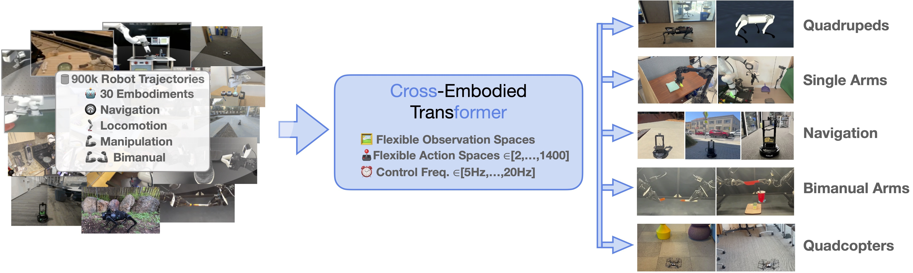

# Scaling Cross-Embodied Learning: One Policy for Manipulation, Navigation, Locomotion and Aviation
<!-- []() -->
[](https://githubtocolab.com/rail-berkeley/crossformer/inference_pretrained.ipynb)
[](https://huggingface.co/rail-berkeley/crossformer)
[](https://www.python.org)
[](https://opensource.org/licenses/MIT)
[](https://crossformer-model.github.io/)

[Ria Doshi](https://www.linkedin.com/in/riadoshi/), [Homer Walke](https://homerwalke.com/), [Oier Mees](https://www.oiermees.com/), [Sudeep Dasari](https://sudeepdasari.github.io/), [Sergey Levine](https://people.eecs.berkeley.edu/~svlevine/)
<hr style="border: 2px solid gray;"></hr>

This repo contains code for training and finetuning CrossFormer. CrossFormer is a transformer-based robot policy trained on 900K robot trajectories across 20 different robot embodiments. Our codebase is built on the [Octo codebase](https://github.com/octo-models/octo).



## Get Started

Follow the installation instructions, then load the pre-trained CrossFormer model! See [our colab notebook](https://githubtocolab.com/rail-berkeley/crossformer/inference_pretrained.ipynb) for an inference example.

```python
from crossformer.model.crossformer_model import CrossFormerModel
model = CrossFormerModel.load_pretrained("hf://rail-berkeley/crossformer")
print(model.get_pretty_spec())
```

Out of the box, CrossFormer can control single and dual arm manipulation systems, wheeled robots, quadcopters, and quadrupeds, and can be instructed via language commands or goal images.
CrossFormer uses a modular attention structure in its transformer backbone, allowing it to be effectively finetuned to robot setups with new sensory inputs, action spaces, and morphologies, using only a small target domain dataset and accessible compute budgets.


## Installation
```bash
conda create -n crossformer python=3.10
conda activate crossformer
pip install -e .
pip install -r requirements.txt
```
For GPU:
```bash
pip install --upgrade "jax[cuda11_pip]==0.4.20" -f https://storage.googleapis.com/jax-releases/jax_cuda_releases.html
```

For TPU
```bash
pip install --upgrade "jax[tpu]==0.4.20" -f https://storage.googleapis.com/jax-releases/libtpu_releases.html
```
See the [Jax Github page](https://github.com/google/jax) for more details on installing Jax.

## Checkpoint

You can find the pre-trained CrossFormer 130M parameter checkpoint [here](https://huggingface.co/rail-berkeley/crossformer).

## CrossFormer Pre-training

To reproduce CrossFormer pre-training, edit [scripts/configs/pretrain_config.py](scripts/configs/pretrain_config.py) to point to your data and log directory. Then, run:

```bash
python scripts/train.py --config scripts/configs/pretrain_config.py
```

To download the pre-training datasets from the [Open X-Embodiment Dataset](https://robotics-transformer-x.github.io/),
install the [rlds_dataset_mod package](https://github.com/kpertsch/rlds_dataset_mod)
and run the [prepare_open_x.sh script](https://github.com/kpertsch/rlds_dataset_mod/blob/main/prepare_open_x.sh).

Pre-training takes 47 hours on a TPUv5-256 pod.

## CrossFormer Finetuning

To run finetuning on your own dataset, convert your dataset to the RLDS format using [this repository](https://github.com/kpertsch/rlds_dataset_builder). Then, edit [scripts/configs/finetune_config.py](scripts/configs/finetune_config.py), and run:

```bash
python scripts/finetune.py --config scripts/configs/finetune_config.py
```

There are a few options for finetuning CrossFormer. If your dataset has an observation space and action space that was used during pre-training, you can finetune from entirely pre-trained weights, using the existing observation tokenizers, action heads, and transformer backbone. Otherwise, you can initialize new observation tokenizers and/or action heads while keeping the pre-trained transformer backbone. Additionally, you may choose to finetune the entire model or freeze the transformer and finetune only the action head. Finally, you can choose to finetune on your data with goal image conditioning, language conditioning, or both.

See the comments in [scripts/configs/finetune_config.py](scripts/configs/finetune_config.py) for an explanation of how to configure these fine-tuning options.


## Citation

```bibtex
@article{doshi24-crossformer,
    title={Scaling Cross-Embodied Learning: One Policy for Manipulation, Navigation, Locomotion and Aviation},
    author={Ria Doshi and Homer Walke and Oier Mees and Sudeep Dasari and Sergey Levine},
    journal={arXiv preprint arXiv:id},
    year={2024}
}
```
